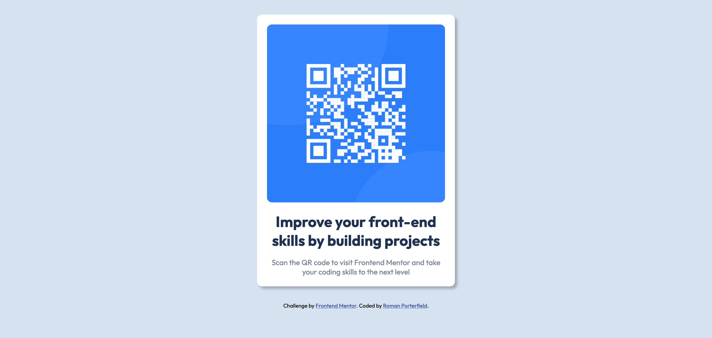

# Frontend Mentor - QR code component solution

This is a solution to the [QR code component challenge on Frontend Mentor](https://www.frontendmentor.io/challenges/qr-code-component-iux_sIO_H). Frontend Mentor challenges help you improve your coding skills by building realistic projects. 

## Table of contents

- [Overview](#overview)
  - [Screenshot](#screenshot)
  - [Links](#links)
- [My process](#my-process)
  - [Built with](#built-with)
  - [What I learned](#what-i-learned)
  - [Continued development](#continued-development)
  - [Useful resources](#useful-resources)
- [Author](#author)
- [Acknowledgments](#acknowledgments)

## Overview

### Screenshot



### Links

- Solution URL: [https://github.com/parallelmedias/Static-QR-Feature-CSS](https://github.com/parallelmedias/Static-QR-Feature-CSS)
- Live Site URL: [https://parallelmedias.github.io/Static-QR-Feature-CSS/](https://parallelmedias.github.io/Static-QR-Feature-CSS/) 

## My process

### Built with

- Basic HTML5 structure
- CSS custom properties
- CSS Flexbox
- Mobile-first design

### What I learned

This was my first self-lead project that was not an adjustment of a tutorial series. My process of laying out the html then stylizing was a good approach that kept me organized.
I learned that I do not understand CSS flex and grid layout, but could use documentation and my browser dev tools to have a visualization of what styles I was adjusting.

While I was working, I used global variables like any other programming language to keep my code cleaner and direct. 

Here is an example of the variables I created and used throughout the project.
```css
:root {
    --white: hsl(0, 0%, 100%);
    --light-gray: hsl(212, 45%, 89%);
    --grayish-blue: hsl(220, 15%, 55%);
    --dark-blue: hsl(218, 44%, 22%);
```

### Continued development

My next projects will have to help me understand css grid and flexbox and push them to memory instead of having to rely on tools and documentation. I also plan to begin animation inclusions to push my use of javascript beyond menu bars.

### Useful resources

- [https://css-tricks.com/snippets/css/a-guide-to-flexbox/](https://css-tricks.com/snippets/css/a-guide-to-flexbox/) - This helped me have a better understanding of flexbox and css principles. The visualizations of a shape was very helpful in applying into my own code and how I was looking at the project. 


